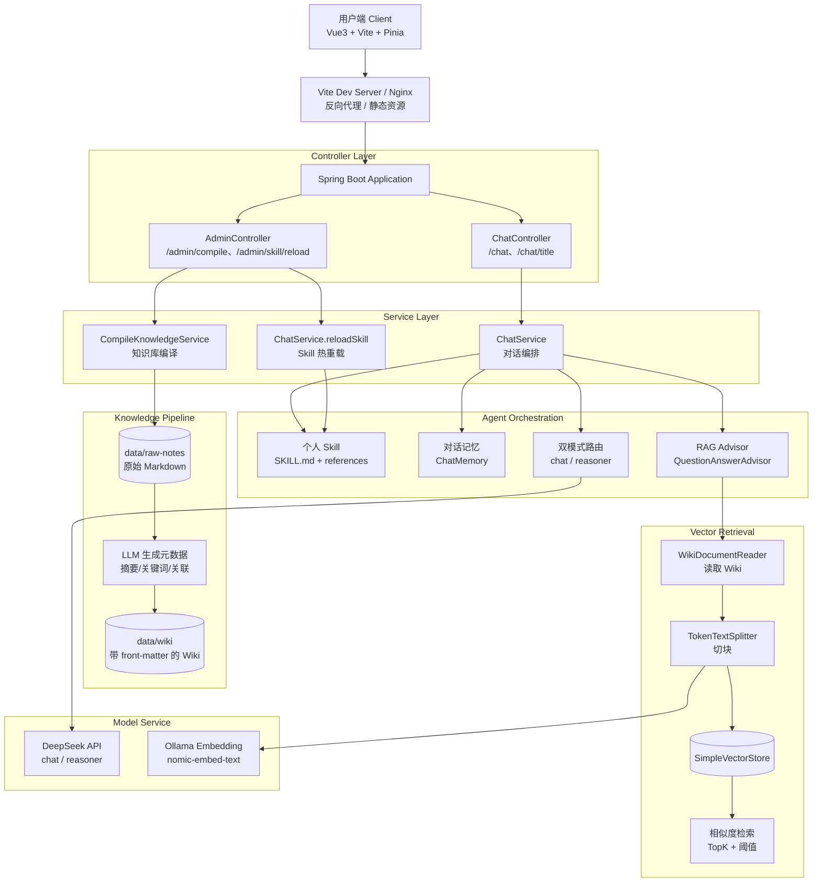
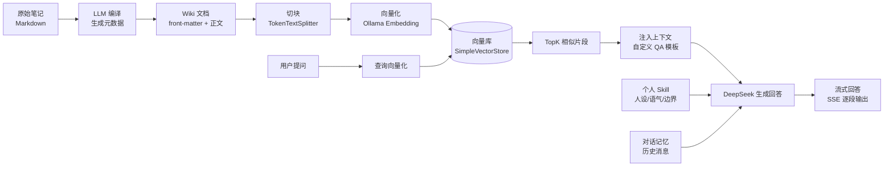
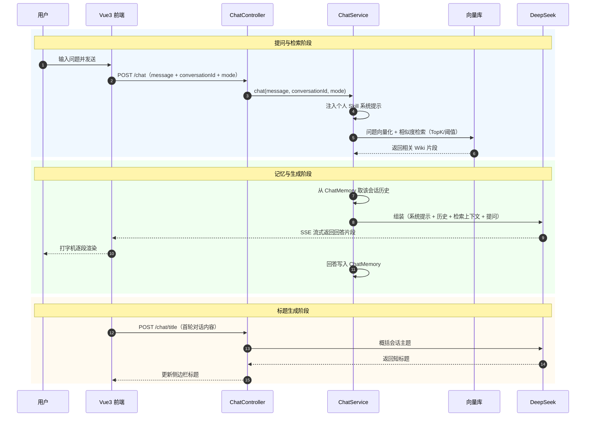

<div align="center">

  <h1>Coder Sean · 个人知识库智能体</h1>
  <p><b>一个基于 Spring AI + DeepSeek 的「个人知识库 RAG 对话智能体」</b></p>

  
  
  
  
  
  
  

  <div style="margin-top: 10px;">
    
    
    
    
    
  </div>
</div>

## 前言
- 本项目为本人 **AI 应用开发**方向的个人实践项目，后端服务、知识库流水线、个人 Skill 机制与前端页面均由本人在学习过程中独立设计与实现。
- 项目的出发点很朴素：**我自己的笔记、博客、代码和踩坑记录太散了**，检索靠记忆、复用靠运气；而通用大模型既不掌握我的私有领域知识，也不懂我的表达习惯与做事风格。于是我想做一个"只属于我"的知识库对话体——它能读我的笔记、按我的风格说话、并且记得我们聊过什么。
- 后续将继续完善：接入 **MCP**、增加 **Rerank 重排序与混合检索**、向量库与对话记忆**持久化**（Redis/JDBC）、以及可观测性与回答效果评估，本人将一边学习 AI 应用开发技术栈一边迭代。

## 项目简介

对于个人开发者来说，知识散落在 Markdown 笔记、技术博客、代码仓库与 AI 会话记录里，**信息不集中、检索效率低、难以复用**是长期存在的痛点；同时，通用大模型虽强，却不了解你的**私有领域知识**，更不会用**你的语气与思路**来回答。

Coder Sean 个人知识库智能体，是一个面向**个人知识管理 + 个性化对话**的 AI 应用。它将零散的原始笔记（`data/raw-notes`）借助大模型**编译**成带元数据的 Wiki（`data/wiki`），再对 Wiki 进行**切块、向量化**写入向量库；对话时通过 **RAG 检索增强**把相关知识注入上下文，并加载一套**个人 Skill（人设 / 语气 / 知识边界）**，让回答既"知道"又"像本人"。

后端采用 **Spring Boot 3.4 + Spring AI 1.0** 编排大模型能力，对话模型接入 **DeepSeek**（OpenAI 兼容协议），向量化使用本地 **Ollama（nomic-embed-text）**，向量存储使用 **SimpleVectorStore**（内存级，便于本地开发测试）。对话链路实现了 **SSE 流式输出、多轮上下文记忆、双模型模式（快速回答 / 深度思考）** 以及 **AI 自动生成会话标题**。前端使用 **Vue 3 + Vite + Pinia** 复刻 DeepSeek 网页版的交互形态：流式打字机输出、Markdown 渲染、深浅色主题切换、对话历史侧边栏。

## 功能特性
- 💬 **对话模块**：SSE 流式对话、打字机输出、多轮上下文记忆（按会话隔离）、AI 自动生成会话标题
- ⚡ **双模式对话**：`快点回答我很急（流式对话模式）` 走 `deepseek-chat`；`容我思考片刻（深度思考）` 走 `deepseek-reasoner`
- 📚 **知识库编译**：扫描 `data/raw-notes` 下的 Markdown，调用 LLM 生成"摘要 / 关键词 / 关联笔记"，输出带 front-matter 的 Wiki，并支持**增量编译**（按文件修改时间判断，只处理新增或变更的文件）
- 🔍 **RAG 检索增强**：Wiki 自动**切块**（TokenTextSplitter）+ **向量化** + **相似度检索**（TopK / 阈值），并定制 QA 提示词，让知识**自然融入**回答而不是"念检索结果"
- 🎭 **个人 Skill**：由 `SKILL.md + references/identity|voice|knowledge-source.md` 组成的个人人设包，启动时加载进系统提示，支持 `POST /admin/skill/reload` **热重载**
- 🧠 **对话记忆**：基于 Spring AI `ChatMemory` + `MessageChatMemoryAdvisor`，按 `conversationId` 维护多轮上下文
- 🎨 **前端体验**：DeepSeek 风格界面、流式打字机、Markdown 渲染（含格式自动纠偏）、深浅色主题、对话历史侧边栏
- 🔐 **配置与安全**：API Key 通过独立 `application-secret.yml` 注入并加入 `.gitignore`；个人资料与笔记目录不入库

## 项目结构
- `src/main/java/.../config`：Spring AI 与向量库配置（`ChatClient`、`SimpleVectorStore`、`QuestionAnswerAdvisor` 及自定义 QA 模板）
- `src/main/java/.../service`：核心业务逻辑（对话编排、知识库编译、个人 Skill 加载与热重载）
- `src/main/java/.../controller`：对外 REST API（`/chat`、`/chat/title`、`/admin/*`）
- `src/main/java/.../vector`：文档读取、切块与索引初始化
- `src/main/java/.../tool`：自定义工具（预留个人 Skill 调用的扩展位）
- `skill`：个人 Skill 包（`SKILL.md` + `references/`）
- `data/raw-notes`：原始 Markdown 笔记（**不入库**）；`data/wiki`：编译后的 Wiki（**不入库**）
- `frontend`：Vue 3 + Vite 前端工程

## 项目文档
- 个人 Skill 使用说明：[`skill/SKILL.md`](./skill/SKILL.md)
- 身份与心智模型：[`skill/references/identity.md`](./skill/references/identity.md)
- 语气与表达风格：[`skill/references/voice.md`](./skill/references/voice.md)
- 知识来源与边界：[`skill/references/knowledge-source.md`](./skill/references/knowledge-source.md)

## 项目地址

> 下方仓库地址为占位，请替换为你实际推送的地址
- GitHub地址：https://github.com/windyfreez/PersonalKnowledgeAgent

## 技术选型

### 后端技术

| 技术名称 | 实现功能 | 官网网址 |
| :------- | :------- | :------- |
| Spring Boot | 后端核心业务逻辑与 RESTful API | https://spring.io/projects/spring-boot |
| Spring AI | 大模型能力统一编排：ChatClient、Advisor、ChatMemory、Structured Output | https://docs.spring.io/spring-ai/reference/ |
| DeepSeek API | 对话模型（OpenAI 兼容协议接入），含 `deepseek-chat` / `deepseek-reasoner` | https://platform.deepseek.com |
| Ollama | 本地 Embedding 服务（`nomic-embed-text`），负责文档与查询向量化 | https://ollama.com |
| SimpleVectorStore | 内存级向量库，存放 Wiki 切块后的向量并做相似度检索 | https://docs.spring.io/spring-ai/reference/api/vectordbs.html |
| QuestionAnswerAdvisor | RAG 检索增强 Advisor，负责"检索 + 上下文注入" | https://docs.spring.io/spring-ai/reference/api/retrieval-augmented-generation.html |
| MessageChatMemoryAdvisor / ChatMemory | 多轮对话记忆（按会话隔离） | https://docs.spring.io/spring-ai/reference/api/chat-memory.html |
| TokenTextSplitter | 长文档切块，提升检索命中精度 | https://docs.spring.io/spring-ai/reference/api/etl-pipeline.html |
| slf4j | 日志门面，编译/索引/对话全链路进度日志 | https://www.slf4j.org/ |

### 前端技术

| 技术名称 | 实现功能 | 官网网址 |
| :------- | :------- | :------- |
| Vue 3 | 构建响应式聊天界面，前端核心框架 | https://vuejs.org/ |
| Vite | 前端构建与开发服务器，代理后端接口 | https://vitejs.dev/ |
| Pinia | 会话状态管理（会话列表、消息、模式、持久化） | https://pinia.vuejs.org/ |
| marked | Markdown 渲染（含格式自动纠偏与代码块保护） | https://marked.js.org/ |
| Nginx | 静态资源服务与反向代理，部署前端应用 | https://nginx.org/ |

---

### 系统架构图



### 知识库数据流



## 业务架构

本系统采用模块化设计思想，将能力划分为**对话交互、知识库编译、RAG 检索、个人 Skill、对话记忆**五个核心模块，各模块相互协作，共同完成"个人知识库智能对话"的业务闭环。

### 对话交互模块

对话交互模块负责用户与智能体之间的消息流转，是整个系统的入口。系统通过 `POST /chat` 暴露 SSE 流式接口，接收用户消息、会话标识与对话模式，返回逐段输出的回答；同时提供 `POST /chat/title`，由大模型概括会话内容自动生成侧边栏标题。接口对前端屏蔽了内部的检索、记忆与工具细节，保证交互体验自然连贯。

### 知识库编译模块

知识库编译模块负责把**零散笔记**加工成**可检索的知识**。系统扫描 `data/raw-notes` 下的 Markdown，对每个文件调用大模型生成"核心摘要 / 关键词 / 关联笔记"三份元数据，再与原文一起写出带 front-matter 的 Wiki 文件。模块支持**增量编译**：按文件修改时间判断，只处理新增或变更的文件，避免重复消耗 Token。

### RAG 检索模块

RAG 检索模块负责"在回答前先找到相关的知识"。应用启动时读取 `data/wiki`，使用 `TokenTextSplitter` 将长文档切分为若干语义块，逐块向量化后写入向量库；对话时把用户问题向量化并做相似度检索（TopK + 阈值），命中片段经**自定义 QA 提示模板**注入上下文。该模板覆盖了 Spring AI 默认"只能基于上下文作答"的僵硬策略，改为"相关就用、不相关就正常回答"，从而避免生硬地回复"知识库中没有"。

### 个人 Skill 模块

个人 Skill 模块负责让回答"像本人"。系统以 `SKILL.md` 为索引，配合 `references/identity.md`（身份与心智模型）、`references/voice.md`（语气与回答架构）、`references/knowledge-source.md`（知识来源与边界）三份文档，在启动时组装进系统提示，明确约束回答的**语气、思路与边界**（如"没把握的领域不下肯定结论"）。模块提供 `POST /admin/skill/reload` 热重载能力，修改 Skill 文档后无需重启即可生效。

### 对话记忆模块

对话记忆模块负责让对话"记得上下文"。基于 Spring AI 的 `ChatMemory` 与 `MessageChatMemoryAdvisor`，以 `conversationId` 为键维护多轮消息；Advisor 被显式设置为最高优先级，确保"原始提问"先入记忆，避免检索到的上下文污染历史记录。

### 模型与模式模块

模型与模式模块负责模型能力的路由。系统支持两种模式：**流式对话模式**使用 `deepseek-chat`，强调快速响应；**深度思考模式**使用 `deepseek-reasoner` 推理模型，适合复杂设计问题。模型通过请求级 `ChatOptions` 动态指定，配置亦可通过 `application.yml` 的 `chat.quick-model` / `chat.think-model` 调整。

### 对话流程图



## 环境搭建

### 开发工具

|     工具     |            说明            |                    官网                    |
| :----------: | :------------------------: | :----------------------------------------: |
|     IDEA     |        Java 开发 IDE       |  https://www.jetbrains.com/idea/download   |
|   WebStorm   |        前端开发 IDE        |  https://www.jetbrains.com/webstorm/       |
|    Apifox    |     接口调试与文档工具     |  https://apifox.com/                       |
|    Ollama    | 本地大模型 / Embedding 服务 |  https://ollama.com/download               |
| DeepSeek 开放平台 | 对话模型 API Key 获取  |  https://platform.deepseek.com             |

### 开发环境

|     工具      |  版本号  |                             下载                             |
| :-----------: | :------: | :----------------------------------------------------------: |
|      JDK      |    17    | https://www.oracle.com/java/technologies/javase/jdk17-archive-downloads.html |
|     Maven     |  3.6.0+  |                   http://maven.apache.org/                   |
|    Node.js    |   16+    |                   https://nodejs.org/                        |
|    Ollama     |  最新版  |                   https://ollama.com/download                |
| Spring Boot   |  3.4.x   |                   https://spring.io/projects/spring-boot     |
|   Spring AI   |  1.0.0   |                   https://spring.io/projects/spring-ai       |

## 快速开始

### 环境要求
- JDK 17+
- Maven 3.6.0+
- Node.js 16+
- Ollama（并已拉取 Embedding 模型）
- DeepSeek API Key

### 后端启动

```bash
# 克隆项目
git clone https://github.com/windyfreez/PersonalKnowledgeAgent.git

# 进入项目目录
cd PersonalKnowledgeAgent

# 1) 启动本地 Embedding 服务并拉取模型
ollama serve
ollama pull nomic-embed-text

# 2) 配置密钥：在项目根目录新建 application-secret.yml（该文件已被 .gitignore 忽略）
# spring:
#   ai:
#     openai:
#       api-key: sk-你的DeepSeek密钥

# 3) 启动后端
mvn spring-boot:run
```

### 知识库准备

```bash
# 1) 把 Markdown 笔记放入 data/raw-notes/

# 2) 编译成 Wiki（生成摘要/关键词/关联笔记）
# POST http://localhost:8080/admin/compile

# 3) 重启后端，启动时自动切块 + 向量化（日志可见向量化进度）
```

### 前端启动

```bash
# 进入前端目录
cd frontend

# 安装依赖
npm install

# 启动开发服务器（已配置 /chat、/admin 代理到 8080）
npm run dev
```

### 访问地址

| 服务 | 地址 |
| :--- | :--- |
| 前端 | http://localhost:5173 |
| 后端 API | http://localhost:8080 |
| Ollama | http://localhost:11434 |

### 部署说明

```bash
# 前端打包
cd frontend
npm run build

# Nginx 配置
# 将 frontend/dist 部署到 Nginx
# 配置反向代理：/chat、/admin 指向后端服务
```

## 接口说明

| 方法 | 路径 | 说明 | 请求体 |
| :--- | :--- | :--- | :--- |
| POST | `/chat` | 流式对话（SSE，`text/event-stream`） | `{ "message": "...", "conversationId": "...", "mode": "quick\|think" }` |
| POST | `/chat/title` | 由 AI 概括会话内容生成短标题 | `{ "text": "首轮对话内容" }` |
| POST | `/admin/compile` | 编译知识库（`data/raw-notes` → `data/wiki`） | 无 |
| POST | `/admin/skill/reload` | 热重载个人 Skill（重新读取 `skill/` 并重建系统提示） | 无 |

## 配置说明

| 配置项 | 说明 | 默认值 |
| :--- | :--- | :--- |
| `spring.ai.openai.base-url` | DeepSeek OpenAI 兼容地址 | `https://api.deepseek.com` |
| `spring.ai.openai.embedding.base-url` | Embedding 服务地址（Ollama） | `http://localhost:11434` |
| `chat.quick-model` | 快速回答模式模型 | `deepseek-chat` |
| `chat.think-model` | 深度思考模式模型 | `deepseek-reasoner` |
| `knowledge.raw-notes-dir` | 原始笔记目录 | `data/raw-notes` |
| `knowledge.wiki-dir` | 编译后 Wiki 目录 | `data/wiki` |
| `knowledge.skill-dir` | 个人 Skill 目录 | `skill` |

## 贡献指南

欢迎贡献代码！请遵循以下步骤：

1. Fork 本仓库
2. 创建特性分支 (`git checkout -b feature/AmazingFeature`)
3. 提交更改 (`git commit -m 'Add some AmazingFeature'`)
4. 推送到分支 (`git push origin feature/AmazingFeature`)
5. 打开 Pull Request

---

如果这个项目对你有帮助，欢迎为它点个 **Star**，这将成为我持续迭代的最大动力 🙏

链接：
- 个人主页：[https://github.com/windyfreez](https://github.com/windyfreez)
- Java 后端学习笔记：[https://github.com/windyfreez/JavaDevelopingNote](https://github.com/windyfreez/JavaDevelopingNote)
- SwapU 云市集：[https://github.com/windyfreez/SwapU](https://github.com/windyfreez/SwapU)
